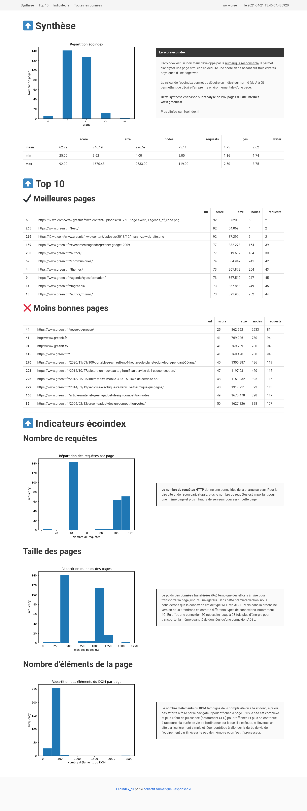

# Ecoindex-Cli

[](https://github.com/cnumr/ecoindex_cli/actions/workflows/quality.yml)
[](https://badge.fury.io/py/ecoindex-cli)

This tool provides an easy way to analyze websites with [Ecoindex](https://www.ecoindex.fr) from your local computer using multi-threading. You have the ability to:

- Make the analysis on multiple pages
- Define multiple screen resolution
- Make a recursive analysis from a given website

This CLI is built on top of [ecoindex-python](https://pypi.org/project/ecoindex/) with [Typer](https://typer.tiangolo.com/)

The output is always a CSV file with the results of the analysis.

## Requirements

- Python ^3.10
- [pip](https://pip.pypa.io/en/stable/)

## Setup

```bash
pip install --user -U ecoindex-cli
```

## Use case

The cli gets 2 commands: `analyze` and `report` which can be used separately:

```bash
ecoindex-cli --help                                
```

```bash
Usage: ecoindex-cli [OPTIONS] COMMAND [ARGS]...

  Ecoindex cli to make analysis of webpages

Options:
  --install-completion [bash|zsh|fish|powershell|pwsh]
                                  Install completion for the specified shell.
  --show-completion [bash|zsh|fish|powershell|pwsh]
                                  Show completion for the specified shell, to
                                  copy it or customize the installation.

  --help                          Show this message and exit.

Commands:
  analyze  Make an ecoindex analysis of given webpages or website.
  report   If you already performed an ecoindex analysis and have your...
```

### Make a simple analysis

You give just one web url

```bash
ecoindex-cli analyze --url https://www.ecoindex.fr
```

<details><summary>Result</summary>

```bash
There are 1 url(s), do you want to process? [Y/n]:
1 urls for 1 window size
Processing  [####################################]  100%
🙌️ File /tmp/ecoindex-cli/output/www.ecoindex.fr/2021-04-20_164433/results.csv written !
```

</details>

> This makes an analysis with a screen resolution of 1920x1080px by default and with the last known version of chromedriver. You can set those settings with options: `--window-size` and `--chrome-version`

### Set the output file

You can define the csv output file

```bash
ecoindex-cli analyze --url https://www.ecoindex.fr --output-file ~/ecoindex-results/ecoindex.csv
```

<details><summary>Result</summary>

```bash
📁️ Urls recorded in file `input/www.ecoindex.fr.csv`
There are 1 url(s), do you want to process? [Y/n]:
1 urls for 1 window size with 2 maximum workers
Processing  [####################################]  100%
🙌️ File /home/vvatelot/ecoindex-results/ecoindex.csv written !
```

</details>

### Export to JSON file

By default, the results are exported to a CSV file. But, you can specify to export the results to a JSON file.

```bash
ecoindex-cli analyze --url https://www.ecoindex.fr --export-format json
```

<details><summary>Result</summary>

```bash
📁️ Urls recorded in file `input/www.ecoindex.fr.csv`
There are 1 url(s), do you want to process? [Y/n]:
1 urls for 1 window size with 2 maximum workers
Processing  [####################################]  100%
🙌️ File /tmp/ecoindex-cli/output/www.ecoindex.fr/2022-03-05_215320/results.json written !
```

</details>

### Multiple url analysis

```bash
ecoindex-cli analyze --url https://www.ecoindex.fr --url https://www.greenit.fr/
```

<details><summary>Result</summary>

```bash
There are 2 url(s), do you want to process? [Y/n]:
2 urls for 1 window size with 2 maximum workers
Processing  [####################################]  100%
🙌️ File /tmp/ecoindex-cli/output/www.ecoindex.fr/2021-04-20_164524/results.csv written !
```

</details>

### Provide urls from a file

You can use a file with given urls that you want to analyze: One url per line. This is helpful if you want to play the same scenario recurrently.

```bash
ecoindex-cli analyze --urls-file input/ecoindex.csv
```

<details><summary>Result</summary>

```bash
There are 2 url(s), do you want to process? [Y/n]:
2 urls for 1 window size with 2 maximum workers
Processing  [####################################]  100%
🙌️ File /tmp/ecoindex-cli/output/www.ecoindex.fr/2021-04-20_164524/results.csv written !
```

</details>

### Make a recursive analysis

You can make a recursive analysis of a given webiste. This means that the app will try to find out all the pages into your website and launch an analysis on all those web pages. ⚠️ This can process for a very long time! **Use it at your own risks!**

```bash
ecoindex-cli analyze --url https://www.ecoindex.fr --recursive
```

<details><summary>Result</summary>

```bash
⏲️ Crawling root url https://www.ecoindex.fr -> Wait a minute !
📁️ Urls recorded in file `/tmp/ecoindex-cli/input/www.ecoindex.fr.csv`
There are 3 url(s), do you want to process? [Y/n]:
3 urls for 1 window size with 2 maximum workers
Processing  [####################################]  100%
🙌️ File /tmp/ecoindex-cli/output/www.ecoindex.fr/2021-04-20_164729/results.csv written !
```

</details>

### Using a specific Chrome version

You can use a specific Chrome version to make the analysis. This is useful if you use an old chrome version. You just have to provide the main Chrome version number.

```bash
ecoindex-cli analyze --url https://www.ecoindex.fr --chrome-version 107
```

Or if you do not know the Chrome version number, you can use the one line command

```bash
ecoindex-cli analyze --url https://www.ecoindex.fr --chrome-version (google-chrome --version  | grep --only -P '(?<=\\s)\\d{3}')
```

### Using multi-threadging

You can use multi-threading to speed up the analysis when you have a lot of websites to analyze. In this case, you can define the maximum number of workers to use:

```bash
ecoindex-cli analyze --url https://www.ecoindex.fr --url https://www.greenit.fr/ --max-workers 10
```

<details><summary>Result</summary>

```bash
There are 2 url(s), do you want to process? [Y/n]:
2 urls for 1 window size with 10 maximum workers
Processing  [####################################]  100%
🙌️ File /tmp/ecoindex-cli/output/www.ecoindex.fr/2021-04-20_164524/results.csv written !
```

> By default, the number of maximum workers is set to CPU count.

</details>

### Disable console interaction

You can disable confirmations, and force the app to answer yes to all of them. It can be useful if you need to start the app from another script, or if you have no time to wait it to finish.

```bash
ecoindex-cli analyze --url https://www.ecoindex.fr --recursive --no-interaction
```

<details><summary>Result</summary>

```bash
⏲️ Crawling root url https://www.ecoindex.fr -> Wait a minute !
📁️ Urls recorded in file `/tmp/ecoindex-cli/input/www.ecoindex.fr.csv`
3 urls for 1 window size with 2 maximum workers
Processing  [####################################]  100%
🙌️ File /tmp/ecoindex-cli/output/www.ecoindex.fr/2021-11-04_081913/results.csv written !
```

</details>

### Set other screen resolutions

You can provide other screen resolutions. By default, the screen resolution is `1920x1080px` but you can provide other resolution for example if you want to test ecoindex for mobile.

```bash
ecoindex-cli analyze --url https://www.ecoindex.fr --window-size 1920,1080 --window-size 386,540
```

<details><summary>Result</summary>

```bash
There are 1 url(s), do you want to process? [Y/n]:
1 urls for 2 window size with 2 maximum workers
Processing  [####################################]  100%
🙌️ File /tmp/ecoindex-cli/output/www.ecoindex.fr/2021-04-21_212244/results.csv written !
```

</details>

### Generate a html report

You can generate a html report easily at the end of the analysis. You just have to add the option `--html-report`.

```bash
ecoindex-cli analyze --url https://www.ecoindex.fr --recursive --html-report
```

<details><summary>Result</summary>

```bash
⏲️ Crawling root url https://www.ecoindex.fr -> Wait a minute !
📁️ Urls recorded in file `input/www.ecoindex.fr.csv`
There are 3 url(s), do you want to process? [Y/n]:
3 urls for 1 window size with 2 maximum workers
Processing  [####################################]  100%
🙌️ File output/www.ecoindex.fr/2021-04-21_212127/results.csv written !
🦄️ Amazing! A report has been generated to /tmp/ecoindex-cli/output/www.ecoindex.fr/2021-04-21_212127/index.html
```

> When generating a html report, the results are written in a CSV file and you can not specify the result file location. So options `--export-format` and `--output-file` are ignored.

</details>

Here is a sample result:


### Only generate a report from existing result file

If you already performed an anlayzis and (for example), forgot to generate the html report, you do not need to re-run a full analyzis, you can simply request a report from your result file :

```bash
ecoindex-cli report "/tmp/ecoindex-cli/output/www.ecoindex.fr/2021-05-06_191355/results.csv" "www.synchrone.fr"
```

<details><summary>Result</summary>

```bash
🦄️ Amazing! A report has been generated to /tmp/ecoindex-cli/output/www.ecoindex.fr/2021-05-06_191355/index.html
```

</details>

## Results example

The result of the analysis is a CSV or JSON file which can be easily used for further analysis:

### CSV example

```csv
width,height,url,size,nodes,requests,grade,score,ges,water,date,page_type
1920,1080,https://www.ecoindex.fr,521.54,45,68,B,75.0,1.5,2.25,2022-05-03 22:28:49.280479,
1920,1080,https://www.greenit.fr,1374.641,666,167,E,32.0,2.36,3.54,2022-05-03 22:28:51.176216,website
```

### JSON example

```json
[
    {
        "width": 1920,
        "height": 1080,
        "url": "https://www.ecoindex.fr",
        "size": 521.54,
        "nodes": 45,
        "requests": 68,
        "grade": "B",
        "score": 75.0,
        "ges": 1.5,
        "water": 2.25,
        "date": "2022-05-03 22:25:01.016749",
        "page_type": null
    },
    {
        "width": 1920,
        "height": 1080,
        "url": "https://www.greenit.fr",
        "size": 1163.386,
        "nodes": 666,
        "requests": 148,
        "grade": "E",
        "score": 34.0,
        "ges": 2.32,
        "water": 3.48,
        "date": "2022-05-03 22:25:04.516676",
        "page_type": "website"
    }
]
```

## Docker

You can use this application in a docker container. You can build the image with the following command:

```bash
docker build -t ecoindex-cli .
```

> You can set a sepcific chrome version using `--build-arg CHROME_VERSION=107.0.5304.121-1` (default is `107.0.5304.121-1`)

And then you can run the container with the following command:

```bash
docker run -it --rm -v $(pwd)/output:/tmp ecoindex-cli:latest ecoindex-cli analyze --url https://www.ecoindex.fr --recursive --chrome-version 107
```

> You have to set the `--chrome-version` option to the same main version as the one used to build the image.

### Fields description

- `width` is the screen width used for the page analysis (in pixels)
- `height` is the screen height used for the page analysis (in pixels)
- `url` is the analysed page url
- `size` is the size of the page and of the downloaded elements of the page in KB
- `nodes` is the number of the DOM elements in the page
- `requests` is the number of external requests made by the page
- `grade` is the corresponding ecoindex grade of the page (from A to G)
- `score` is the corresponding ecoindex score of the page (0 to 100)
- `ges` is the equivalent of greenhouse gases emission (in `gCO2e`) of the page
- `water`is the equivalent water consumption (in `cl`) of the page
- `date` is the datetime of the page analysis
- `page_type` is the type of the page, based ton the [opengraph type tag](https://ogp.me/#types)

## Testing

In order to develop or test, you have to use [Poetry](https://python-poetry.org/), install the dependencies and execute a poetry shell:

```bash
poetry install && \
poetry shell
```

We use Pytest to run unit tests for this project. The test suite are in the `tests` folder. Just execute :

```bash
pytest --cov-report term-missing:skip-covered --cov=. --cov-config=.coveragerc tests
```

> This runs pytest and also generate a [coverage report](https://pytest-cov.readthedocs.io/en/latest/) (terminal and html)

## Disclaimer

The LCA values used by [ecoindex_cli](https://github.com/cnumr/ecoindex_cli) to evaluate environmental impacts are not under free license - ©Frédéric Bordage
Please also refer to the mentions provided in the code files for specifics on the IP regime.

## [License](LICENSE)

## [Contributing](CONTRIBUTING.md)

## [Code of conduct](CODE_OF_CONDUCT.md)
